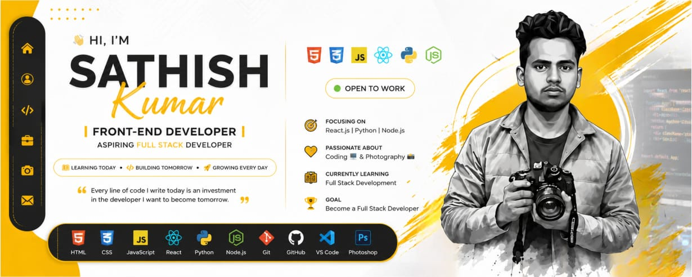

<!-- ========================================================= -->
<!--                  SATHISHKUMAR K • README                  -->
<!-- ========================================================= -->

<div align="center">



<br/>

# ⚡ SATHISHKUMAR K

### `FRONT-END DEVELOPER` · `REACT.JS DEVELOPER` · `ASPIRING FULL STACK DEVELOPER`

<br/>


<br/><br/>

<a href="https://sathishkcoder.github.io/resume/">

</a>

<a href="https://github.com/sathishkofficial01">

</a>

<a href="https://linkedin.com/in/sathishkofficial01">

</a>

</div>

---

# 👨‍💻 ABOUT ME

<table>
<tr>
<td width="62%" valign="top">

### `> whoami`

I'm **Sathishkumar K**, a passionate **Front-End Developer** focused on creating modern, responsive and user-friendly web applications.

I enjoy transforming ideas into clean interfaces and continuously improving my development skills through real-world projects.

### `CURRENT STATUS`

```text
💻  Front-End Developer
⚛️  React.js Developer
🌱  Learning Full Stack Development
🐍  Python Learner
🚀  Building Real-World Projects
📸  Photography Enthusiast
💼  Open To Opportunities
